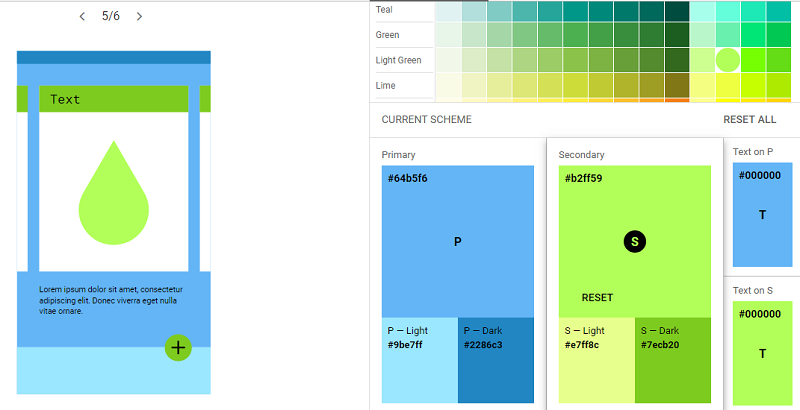

#Pokemon-Data Lovers

## INVESTIGACIÓN DEL USUARIO Y PROTOTIPADO

### Usuario

### **1.- Definición del producto.**

Como equipo hemos recurrido a diferentes herramientas y realizado una serie de etapas de investigación para poder cumplir de forma optima las necesidades del usuario . 

En primer lugar tomamos el desafío de _**aprender conceptos claves del juego**_ para poder tener una idea global del funcionamiento de éste. Para ello hablamos con usuarios de la aplicación Pokemon Go, los cuales manifestaron a grandes rasgos los puntos que consideraban relevantes para ellos.

Como segundo lugar elaboramos un breve _**cuestionario**_ basándonos en lo dicho por los jugadores y los recursos con los que se contaban, con el fin de evaluar y filtrar la información, descartando aquella que resulta poco relevante si no se encuentra sincronizado con el juego(por ejemplo: distancia del huevo,frecuencia de aparición, rango de distancia, etc).

Finalmente determinamos que nuestra página está dirigida principalmente a jugadores principiantes y seguidores de la serie, que quieran tener información de las capacidades de sus pokemon, teniendo una interfaz sencilla que le permita conocer los tipos de pokemon existentes y de ver las debilidades de cada uno, además de poder filtrar de acuerdo a las categorías ya mencionadas. También, como facilitador de búsqueda, se incluyó un selector que permite al usuario ordenar de forma alfabética y numérica de forma ascendente y descendente. Como otro punto se pensó en el uso de modales para mostrar información más específica de cada pokemon y no saturar visualmente la página principal.

### **2.- Historias de usuario** 

En el siguiente enlace se puede ver la planificación del proyecto y buscar las historias de usuario organizadas mediante el trabajo colaborativo en [Trello](https://trello.com/b/FtpL7G78/pokemon) , o ver en detalle cada historia de usuario a través de estos enlace directos a cada una de ellas puestos en los item inferiores.
- [Historia de usuario 1](https://trello.com/c/5Ssujcum/20-hu-1)
- [Historia de usuario 2](https://trello.com/c/PO4caJLp/21-hu-2)
- [Historia de usuario 3](https://trello.com/c/o4EC464E/22-hu-3)
- [Historia de usuario 4](https://trello.com/c/pBktnNl4/43-hu-4)

### **3.- Diseño de la Interfaz de Usuario**

#### Prototipo de baja fidelidad.

Dentro del proceso creamos _**prototipos de baja fidelidad**_, donde se tomaron los puntos principales obtenidos a través del cuestionario (realizado durante el estudio del usuario), para ser utilizados en la página con la idea de ayudarlo.

[Fotografía prototipo de baja fidelidad en Drive](https://drive.google.com/open?id=1MjarByTzzLahgDzRsPdHXtEMfL8bg592)

#### Prototipo de alta fidelidad

 Pasamos al _**prototipo de alta fidelidad**_ apoyandonos de la plataforma Figma, *dividido* en 2 partes. El primero en [formato web](https://www.figma.com/proto/UklgZbnbeiRK3uRGfYdwxycz/Pokemon-prototipe?node-id=44%3A1&scaling=min-zoom) con las opciones filtrar (por tipo o debilidad), ordenar (por nombre o número), además de lanzar el cálculo de pokemon débiles a cierto tipo, en el filtro "debilidad".El segundo en [formato móvil](https://www.figma.com/file/dHEHnZKbmbC33I0HEpZOxOSB/App-Pokemon-para-celular?node-id=0%3A1), con la opción de calcular.
Aquí podrás ver los prototipos en [Zeplin](zpl.io/VQvB34m)

#### Testeos de usabilidad.

[Video Test de Usuario en Drive](https://drive.google.com/open?id=1YLESpd8c1876sfjE_PMoM8ctx_t6_vve)

**Iteraciones durante el testing:**

- Una de las dificultades presentadas por el usuario fueron las de encontrar el botón para volver a ver todas las tarjetas, el cual se encontraba en el logo, por lo que se coloco de forma literal con el texto clickeable de "Ver todos los pokemon".
- Otra de las cosas que le interesaban al usuario eran la de saber donde estaban posicionado al realizar los filtros, por ejemplo: al filtrar por tipo "fuego", tener algún lugar en la página donde señalara que los pokemon mostrados eran de tipo "fuego". Esto se resolvió al incluir el cálculo, en donde al mostrarle al usuario la cantidad de pokemon que existen por ese tipo determinado, aparece además el nombre de la selección, por ejemplo:"Existen 21 pokemon tipo Planta".

